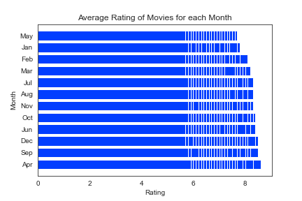

# Microsoft Movie Analysis
**Authors:** Elliott Iturbe, Colette Crowder, Will Toranto

## Overview
This project aims to discover how to make the most profitable movie possible in order to make business recommendations to Microsoft. Descriptive analyses of a variety of data on previously released movies reveal that the most profitable movie Microsoft could make is an adventure movie with an NR rating, directed by Jean Negulsesco, with a runtime between 100 minutes and 131 minutes, at Buena Vistas studios.

## Business Problem
Microsoft wants to open a movie studio that can compete with other successful movie studios. However, they lack knowledge about filmmaking. To help them in this area, we will find out how a variety of factors affect the popularity of movies and offer recommendations.

## Data
We examined data on gross, genre, studio, director, release date, MPR rating, Rotten Tomatoes score, and run time. Variables like gross and Rotten Tomatoes score served as measures of the success of movies. The relationship between the rest of the variables and those two measures of success demonstrate what factors can be relied upon to make a profitable movie.

## Methods
Our process started with organizing our data by dropping irrelevant columns, creating new ones, sorting by specific values, and merging dataframes. While modeling our data, we used descriptive statistics to create helpful visuals that displayed our findings. Overall, our descriptive analysis is absolutely essential for anyone looking to succeed in the movie industry.

## Results

This shows what genre of movie Microsoft should make based on which genre has the highest worldwide gross.


This gives us a visual of the Rotten Tomatos Generated rating for the MPA rating for the Adventure movies from the dataframe.


This graph shows the most profitable directors for adventure movies, and we conclude that Jean Negulesco is by far the best choice.


Buena Vistas Studios ("BV") is responsible 65% of the top 20 grossing movies. If Microsoft is interested in using another studio to make their film, Buena Vistas would be a great choice.


This is a comparison of runtime to revenue that tells Microsoft that there is no true monetary value for creating a movie outside of the shaded area.


This graph shows the average rating for movies for each month that they are released and since there is no significant diffference between each one, we conclude that release month doesn't really matter.




## For More Information

Please review our full analysis in [our Jupyter Notebook](./Final Notebook.ipynb) or our [presentation](./microsoft_movie_analysis.pdf).

For any additional questions, please contact **Elliott Iturbe at eaiturbe@bsc.edu, Will Toranto at williamtoranto@gmail.com, or Colette Crowder at crcrowde@bsc.edu**

## Repository Structure

Describe the structure of your repository and its contents, for example:

```
├── README.md                           <- The top-level README for reviewers of this project
├── dsc-phase1-project-template.ipynb   <- Narrative documentation of analysis in Jupyter notebook
├── DS_Project_Presentation.pdf         <- PDF version of project presentation
├── data                                <- Both sourced externally and generated from code
└── images                              <- Both sourced externally and generated from code
```

